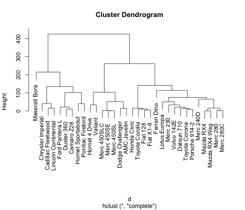
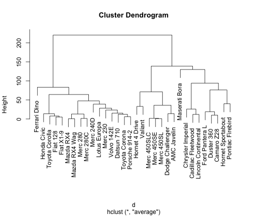
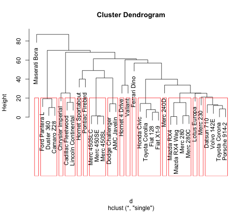

---

title       : Hierarchical Clustering on mtcars
subtitle    : A tree structured machine learning algorithm on a dataset
author      : 
job         : 
framework   : io2012        # {io2012, html5slides, shower, dzslides, ...}
highlighter : highlight.js  # {highlight.js, prettify, highlight}
hitheme     : tomorrow      # 
widgets     : []            # {mathjax, quiz, bootstrap}
mode        : selfcontained # {standalone, draft}
knit        : slidify::knit2slides  

---


* One of the important clustering algorithms is Hierarchical Clustering. The idea is to build a tree where the leaves of the trees are observations.


* The way to build the tree is to put two observations into one cluster if they are close in distance and create one level up. Conntinuing this way until all observations belong to one cluster, generating a tree.


* For this exercise, we will use mtcars as the dataset to build a tree. In mtcars, there are 32 obsevations, and therefore we should have 32 leaves for the tree. Note that because there are 11 features in mtcars instead of just one feature, the same cylinder cars do not generally close to each other for example. If we only consider the feature cyl, we would get a clustering tree that consists of 3 branches on the bottom based on the number of cylinders over euclidean distance.

* The purpose of the presentation is to show how to use Hierarchical Clustering to create plots based on different distance metrics or different methods.

* One thing to note is that in k-means clustering, we need to specify the number of clusters. But in Hierarchical Clustering we do not require such a number. Also because of the tree structure it makes better visualization.

---

Here is the r code to generate the plot with euclidean distance over complete method:


```r
   d <- dist(as.matrix(mtcars),  method = "euclidean")
   hc <-  hclust(d, method="complete") 
   plot(hc)
```

 

---

Another popular method is average. Here is the plot with maximum distance metric:


```r
   d <- dist(as.matrix(mtcars),  method = "maximum")
   hc <-  hclust(d, method="average") 
   plot(hc)
```

 

---

We can specify a number of clusters, for instance with 17 clusters on single method a plot looks like this


```r
d <- dist(as.matrix(mtcars),  method = "euclidean")
hc <-  hclust(d, method="single") 
plot(hc)
rect.hclust(hc, 17, border="red")
```

 

